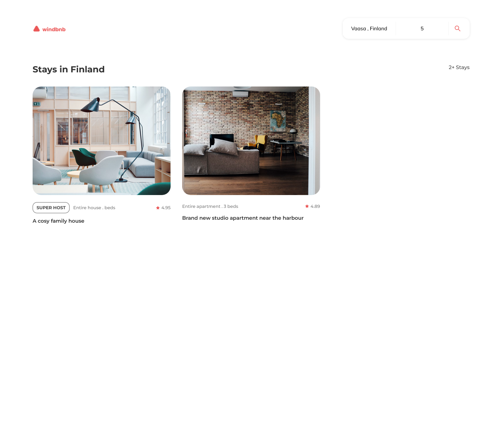
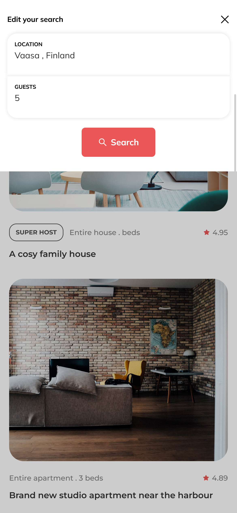

<!-- Please update value in the {}  -->

<h1 align="center">Windbnb - A minimal version of Airbnb</h1>

  <h3>
    <a href="https://manthan-kuber.github.io/windbnb/">
      Live Demo
    </a>
     | 
    <a href="https://devchallenges.io/challenges/3JFYedSOZqAxYuOCNmYD">
      Challenge
    </a>
  </h3>

<!-- TABLE OF CONTENTS -->

## Table of Contents

- [Overview](#overview)
- [Learnings](#learnings)
- [Contact](#contact)

<!-- OVERVIEW -->

## Overview

Desktop Screenshot

Mobile Screenshot

This application/site was created as a submission to a [DevChallenges](https://devchallenges.io/challenges) challenge. The [challenge](https://devchallenges.io/challenges/OEKdUZ6xs0h99C38XVht) was to build an application to complete the given user stories.

### Built With

<!-- This section should list any major frameworks that you built your project using. Here are a few examples.-->

- [React](https://reactjs.org/)
- [StyledComponents](https://styled-components.com/)

## Learnings

- Learned about React Portal and how to create a modal using React Portal
- Learned complex state management with useReducer
- Learned about Context API and useContext
- Learned about Prop drilling
- Learned about Custom Hooks
- Handled complex state logic using useReducer + useContext
- Improved working with JSON data
- Improved CSS logic and conditional rendering logic
- Improved React Logic & "Thinking in React"

## Contact

- GitHub [@Manthan-Kuber](https://github.com/Manthan-Kuber)
